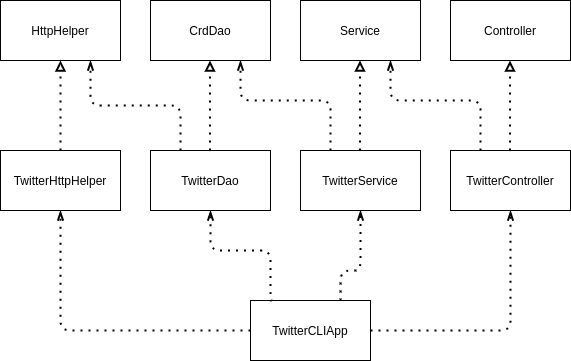

# Introduction
This app allows users to post, view, and delete tweets from Twitter with a developer account. The 
main purpose of creating this app was to learn about more technologies that can be used alongside 
Java. 

Some examples of technologies used were the REST API to interact with Twitter, Maven and Spring as 
dependency managers, JUnit and Mockito for testing, and Docker to create a container for the app.

# Quick Start

Use the following steps to get the app running on your machine:

## Maven
Using the source code in this repository, the app can be packaged with Maven using the command 
`mvn clean compile package`, which will create the jar file for the app.

## Docker
The jar file can then be used to create a local container to run the app. Create a dockerfile:
```
FROM openjdk:8-alpine
COPY path/to/target/java_apps*.jar path/to/lib/twitter.jar
ENTRYPOINT ["java","-jar","/path/to/lib/twitter.jar"]
```
Use the dockerfile to create a local image with the following commands:
```
# log in to docker via command line
docker_user=your_docker_id
docker login -u ${docker_user}

# build docker image
docker build -t ${docker_user}/twitter
docker run --rm \
-e consumerKey=your_consumer_key \
-e consumerSecret=your_consumer_secret \
-e accessToken=your_access_token \
-e tokenSecret=your_token_secret \
${docker_user}/twitter [post|show|delete] [args]
```

## Options

The app allows 3 main commands to be performed: `post`, `show`, and `delete`.
```
twitter post "text" "lat:lon"

Post a tweet with the given text and coordinates
text: Tweet text (must be surrounded by quotations)
lat/lon: Desired latitude and longitude of the location of Tweet (formatted as "[lat]:[lon]")
```

```
twitter show id

Show a tweet with the given tweet id
id: number string of requested tweet id
```

```
twitter delete "id1,id2,...,idn"

Delete a list of tweets with the given tweet ids
ids: comma separated list of ids of tweets to delete
```

# Design

## Main
The main class of the app is `TwitterCLIApp`, which creates all of the components of the app and 
sets up the appropriate dependencies. This class parses the main command (e.g. post, show, delete) 
and passes the arguments to the corresponding method in the controller layer.

## Components
### Controller
The controller class is `TwitterController`, an implementation of the `Controller` interface. It 
parses the arguments of the specific command and passes them into the Service layer.

## Service
The service class is `TwitterService`, an implementation of the `Service` interface. It contains the 
business logic of the code, which consists of verifying that the arguments for the command are valid
(e.g. if posting a tweet, ensure that the text is 140 characters or less).

## DAO
The DAO class is `TwitterDao`, an implementation of the `CrdDao` interface. It acts as an interface 
between the REST API and the rest of the app by building the proper API request and returning an 
object converted from the response JSON. The DAO also has a helper class that executes the API 
request.

# Models
The Tweet class is a simplified version of the Tweet JSON that is returned by the Twitter API in 
POJO form. It contains the following fields:
- `createdAt`: time of Tweet creation
- `id`: Tweet id in integer form
- `idStr`: Tweet id in string form
- `text`: Tweet text
- `entities`: Contains miscellaneous Tweet entities, like user mentions and hashtags
- `coordinates`: A 2-element list of the coordinates from which the Tweet was sent
- `retweetCount`: Number of times this tweet was retweeted
- `favoriteCount`: Number of times this tweet was favorited
- `retweeted`: Boolean of whether the tweet was retweeted
- `favorited`: Boolean of whether the tweet was favorited

# Spring
Because of the dependency relationships between classes, a lot of setup was required to properly 
initialize the app. This can potentially introduce errors and is a lot of manual work. Instead of 
manually setting up dependencies, the app uses Spring to manage dependencies within the app. 

The Component Scan method of dependency injection given by Spring allows for developers to mark 
classes that are components of the app that require dependencies, and Spring takes care of setting 
up dependencies using the constructors of each of the components.

# Docker
Dockerizing the app consists of completing the steps laid out in the quick start section. This app 
is available on Dockerhub under the user `Kyaels`.

# Improvements
- Improve testing approach. In particular, I want to test for exceptions in a safer manner.
- Implement field argument, in which the user may optionally add an argument to choose which fields 
of the JSON object to display.
- Remove some hardcoded, repeated strings from error messages to reduce redundancy.