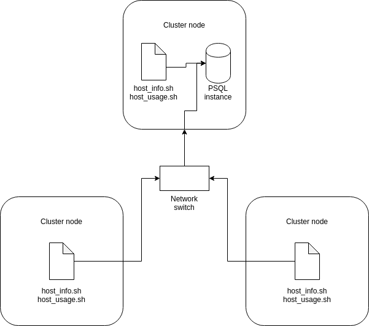

# Linux Cluster Monitoring Agent
The Linux Cluster Monitoring Agent is an internal tool made to monitor the resources used in a network of Linux computers. Every minute, it samples memory and disk usage information for each computer in the cluster and stores the information in a database. The database can later be queried to determine statistics about the cluster. 

The monitoring agent can be used to help the infrastructure team in finding out about whether computers need more or less resource allocation, or see if a computer in the network has failed.

# Quick Start
- Start a psql instance using psql_docker.sh
```
bash ./scripts/psql_docker.sh create [db_username] [db_password]
```
- Create tables using ddl.sql
```
psql -h localhost -U [db_username] -d host_agent -f ./sql/ddl.sql
```
- Insert hardware specs data into the db using host_info.sh
```
# Done on every computer that needs to be monitored
bash ./scripts/host_info.sh localhost 5432 host_agent [db_username] [db_password]
```
- Insert hardware usage data into the db using host_usage.sh
```
# Not done directly; used in crontab (see below)
```
- Crontab setup
```
# Done on every computer that needs to be monitored
# Enter command into terminal
crontab -e

# A file should be opened in the editor. Add the following line to the file and save
* * * * * bash /path/to/directory/scripts/host_usage.sh localhost 5432 host_agent [db_username] [db_password]
```

# Architecture Diagram


# Database Modeling
- `host_info`

| Column | Description |
| --- | --- |
| `id` | ID number of computer. Assigned in order of insertion into database. |
| `hostname` | Name of computer. Computers in the network are assigned names uniquely. |
| `cpu_number` | Number of CPUs in the computer. |
| `cpu_architecture` | Architecture of CPU. |
| `cpu_model` | Model of CPU. |
| `cpu_mhz` | Clock speed of CPU in MHz. |
| `l2_cache` | Size of L2 cache in KB. |
| `total_mem` | Size of RAM. |
| `timestamp` | Timestamp of when the information was collected in UTC. |

- `host_usage`

| Column | Description |
| --- | --- |
| `timestamp` | Timestamp of when the information was collected in UTC. |
| `host_id` | ID number of computer. See `id` in `host_info`. |
| `memory_free` | Amount of free memory in KB. |
| `cpu_idle` | Percentage of time the CPU is idle. |
| `cpu_kernel` | Percentage of time the CPU runs kernel code. |
| `disk_io` | Number of I/O operations performed on the disk. |
| `disk_available` | Amount of free storage on the disk in MB. |

## Scripts

- psql_docker.sh: Script to create a PSQL instance in docker. Can also be used to start and stop the instance.
```
# db_username and db_password needed only when creating instance
bash ./scripts/psql_docker.sh start|stop|create [db_username] [db_password]
```

- host_info.sh: Script to parse hardware information on the computer and insert it into the database.
```
bash ./scripts/host_info.sh [psql_host] [psql_port] [db_name] [db_username] [db_password]
```
- host_usage.sh: Script to parse current resource usage information and insert it into the database.
```
bash ./scripts/host_usage.sh [psql_host] [psql_port] [db_name] [db_username] [db_password]
```
- crontab: We would like to monitor usage information by running host_usage.sh every minute. The Linux utility crontab allows us to achieve this.
```
# Open crontab file
crontab -e

# Add a line to schedule the running of host_usage.sh once every minute.
* * * * * bash path/to/directory/scripts/host_usage.sh [psql_host] [psql_port] [db_name] [db_username]
```
- queries.sql: Queries are used to examine the data received from the monitoring agent. queries.sql contains 3 queries that may be useful to the infrastructure team.
  - Query 1: Sorts the list of cluster nodes by number of CPUs and total memory. This allows the infrastructure team to quickly determine which nodes have been allocated the most resources.
  - Query 2: Shows average percentage of memory used in 5-minute intervals for each node. This allows the infrastructure team to see if computers are being allocated too much or too little memory based on how much is used in small periods of time.
  - Query 3: Shows nodes that fail to report to the database 3 or more times in a 5-minute period. This is a quick way to check whether any servers are failing.
```
psql -h [psql_host] -U [db_username] -d [db_name] -f ./sql/queries.sql
```

## Improvements 
- Create a script to update the host_info database whenever a computer has its hardware modified.
- Fix the issue in query 3 where a failure is reported when the crontab job is started in the last 2 minutes of a 5 minute interval.
- Add the option to remove a psql instance using psql_docker.sh
