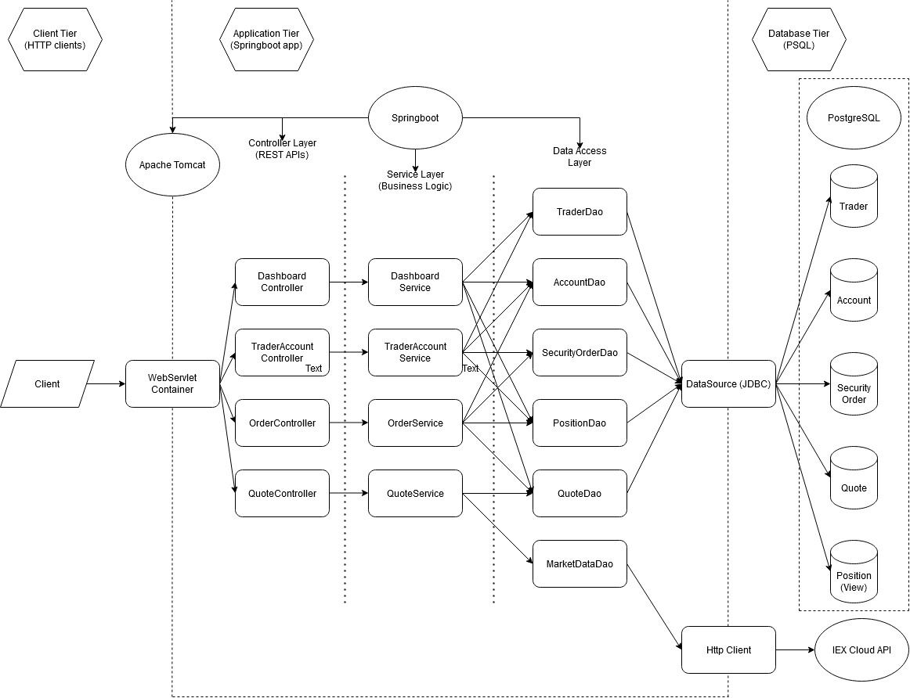

Table of contents
* [Introduction](#introduction)
* [Quick Start](#quick-start)
* [Architecture](#architecture)
* [REST API Usage](#rest-api-usage)
* [Docker Deployment](#docker-deployment)
* [Improvements](#improvements)

# Introduction
This application is an online stock trading simulator using a REST API that can be used by front-end 
developers, mobile developers, and traders. It retrieves and stores real stock market information 
which can be used to trade stocks with simulated funds.

The application is a Microservice backend that is implemented using Java and Springboot with a PSQL 
database. The stock market data is retrieved from the IEX Cloud API.

# Quick Start
- Pre-requisites: 
    - Docker v17.05
    - CentOS 7
    - [IEX Cloud](https://iexcloud.io) account with a public key
- Docker Scripts
    - Build images
    ```
    # Build PSQL image
    cd psql
    docker build -t trading-psql .
 
    # Build app image
    cd ..
    docker build -t trading-app .
    ```

    - Create docker network
    ```
    docker docker network create --driver bridge trading-net
    ```
  
    - Start containers
    ```
    # Start PSQL container
    docker run --name trading-psql-dev \
    -e POSTGRES_PASSWORD=password \
    -e POSTGRES_DB=jrvstrading \
    -e POSTGRES_USER=postgres \
    --network trading-net \
    -d -p 5432:5432 trading-psql
  
    # Set IEX Token (from your IEX Cloud account)
    IEX_PUB_TOKEN=your_token
  
    # Start application container
    docker run --name trading-app-dev \
    -e "PSQL_URL=jdbc:postgresql://trading-psql-dev:5432/jrvstrading" \
    -e "PSQL_USER=postgres" \
    -e "PSQL_PASSWORD=password" \
    -e "IEX_PUB_TOKEN=${IEX_PUB_TOKEN}" \
    --network trading-net \
    -p 8080:8080 trading-app
    ```
  
  - To stop containers (after using app)
  ```
  docker container stop trading-psql-dev trading-app-dev
  ```

# Architecture

- briefly explain the following components and services (3-5 sentences for each)
- Controller layer
  - The controller layer handles user requests that are parsed (by Springboot) from the REST API 
  methods. There are controllers for orders, quotes, and traders. The controllers take the arguments 
  of the REST URL/request body and pass them to the appropriate service layer method.
- Service layer
  - The service layer handles business logic of the application. It ensures that the arguments are 
  valid before passing them to the DAO layer. Each controller class has a respective service class 
  associated with it.
- DAO layer
  - The DAO layer handles data storage and retrieval. The DAOs make calls to access the PSQL 
  instances through the DataSource class. It also accesses an external REST API to retrieve data 
  from IEX.
- Springboot
  - Springboot provides the simplifications for configuration processes in Spring applications. It 
  provides an Apache TomCat WebServlet container, which automatically handles REST API calls from 
  clients and hands them to the application. It also provides inversion of control, which allows 
  class dependencies within the program to automatically be constructed, along with other features 
  that allow the developer to get a Spring application started quickly.
- PSQL and IEX
  - The DAO layer communicates with the database tier. The database consists of a PSQL instance with 
  tables to store accounts, quotes, security orders, and traders. The DAO layer also communicates 
  with IEX Cloud through an HTTP client to access IEX Cloud's REST API to provide the application 
  with updated stock market data.

# REST API Usage
## Swagger
Swagger is a set of open-source tools built around the OpenAPI Specification that can help design, 
build, document and consume REST APIs. It is a powerful tool that assists in the entire development 
cycle of the API.
## Quote Controller
The quote controller accepts quotes to track from the user and uses data from IEX Cloud to update 
them for the user to retrieve in the future. All quotes are stored on a PSQL instance.
- GET `/quote/dailyList`: Retrieves a list of all tracked quotes.
- GET `/quote/iex/ticker/{ticker}`: Retrieves data for a quote with a given ticker from IEX.
- PUT `/quote/`: Inserts a quote (found in the request body) into the database.
- PUT `/quote/iexMarketData`: Updates all tracked quotes with data from IEX.
- POST `/quote/tickerId/{tickerId}`: Finds a quote with a given ticker from IEX and stores it in the 
database.
## Trader Controller
The trader controller allows users to register themselves as traders and deposit and withdraw funds 
for trading.
- POST `trader//firstname/{firstname}/lastname/{lastname}/dob/{dob}/country/{country}/email/{email}`:
Creates a trader with the given information, stores it in the database and creates an account for 
that trader.
- POST `/`: Creates a trader with information from request body, stores it in the database and 
creates an account for that trader.
- DELETE `/traderId/{traderId}`: Deletes a trader with the given trader ID and their corresponding 
account. The trader must have no funds in their account and no open positions.
##Order Controller
The order controller handles execution of market orders from accounts.
- POST `/marketOrder`: Submits a market order as given from the request body.

# Improvements
- Improved unit testing (testing was primarily integration)
- Implement a dashboard to show traders
- Allow for multiple orders to be processed in one API request
- Look for alternatives to IEX Cloud for data (as data from IEX Cloud is delayed)
- Instead of having API endpoints to update data, update relevant data automatically when requested
